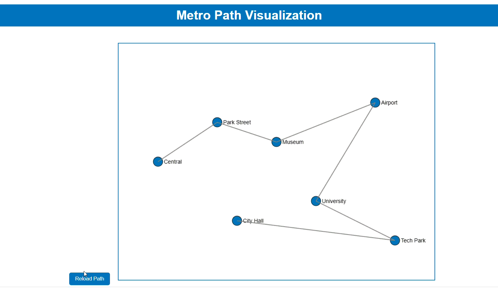

# Transit Navigator

 **Transit Navigator** is a Shortest pathfinding and visualization project that helps users find the shortest route between two stations and visualize the journey.  
The project combines **C++ (for backend shortest path logic)** with **HTML, CSS, and JavaScript (for frontend visualization)**.  

## Features
- Add/remove stations and connections dynamically  
- Save and load network data in **JSON format**  
- Compute shortest path using **Dijkstra’s algorithm**  
- Export computed path to JSON and visualize it in the browser  
- Animated path visualization (station-to-station movement)  

## 🛠️ Tech Stack
- **C++** → Core logic for graph and shortest path  
- **nlohmann/json** → JSON handling in C++  
- **HTML, CSS, JavaScript** → Visualization and animation  

## Run Instructions

### C++ Program
g++ main.cpp MetroMap.cpp utils.cpp -I. -o METROAPP.exe                              
.\METROAPP.exe     
### Output

#### Shortest Path Demo

<!-- GIF animation -->
.

